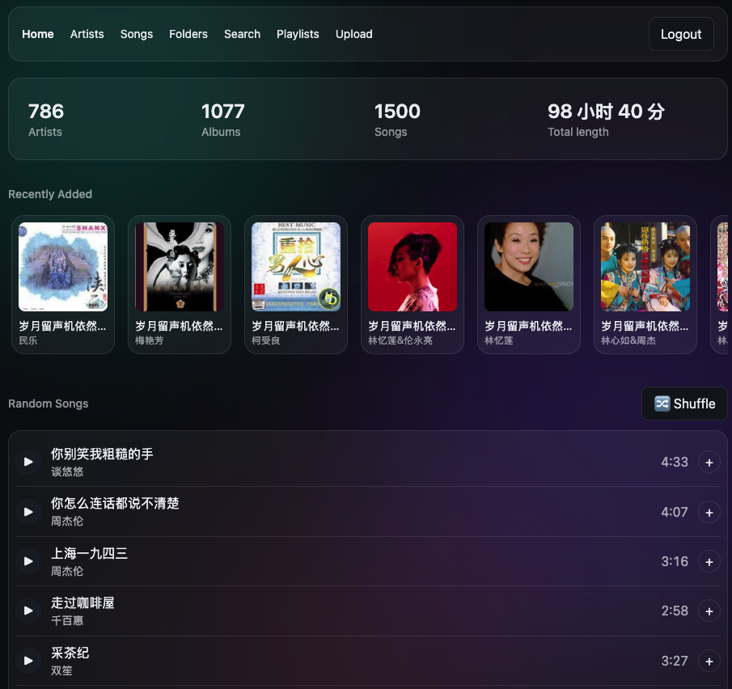

# Subsonic Telegram

*[English](README.md) | 中文*

把 Telegram 变成免费、无限容量的私人音乐云盘：一个 Cloudflare Worker 直接实现 [Subsonic REST API](http://www.subsonic.org/pages/api.jsp)，音频文件本体存在 Telegram 私有频道里（走官方 Bot API，不依赖 rclone/WebDAV 之类的中间层），元数据存 Cloudflare D1。任何支持 Subsonic 协议的客户端（Amperfy、DSub、Ultrasonic、substreamer……）都能直接连上来听歌、管理歌单。

整个方案没有常驻服务器——Worker 按请求触发，D1 和 Telegram 都是托管服务，播放时 seek/拖进度条走的是 Telegram 文件下载接口原生支持的标准 HTTP Range（已实测验证），不需要额外绕路。

**当前限制**：单个音乐文件不超过 20MB（Telegram Bot API `getFile` 的硬限制），超过的文件导入时会被跳过。以后如果需要支持更大文件（比如无损专辑),再考虑分片或换用 MTProto/其它存储后端。



## 前置要求

- 一个 Telegram 账号（用来建 bot 和私有频道，见下面[准备工作](#准备工作创建-telegram-bot-和频道)）
- 一个 Cloudflare 账号（Workers + D1 在个人使用规模下都在免费额度内）
- Node.js 22+ 和 npm（跑本地脚本、构建 Web UI）
- [Wrangler CLI](https://developers.cloudflare.com/workers/wrangler/)（`npm install -g wrangler`，或者用 `npx wrangler`），并 `wrangler login` 登录

## 目录

- [架构](#架构)
- [R2 缓存（可选）](#r2-缓存可选)
- [目录结构](#目录结构)
- [已实现的端点](#已实现的端点)
- [准备工作：创建 Telegram Bot 和频道](#准备工作创建-telegram-bot-和频道)
- [部署方式：Cloudflare Git 集成](#部署方式cloudflare-git-集成workers-builds)
- [导入本地音乐库](#导入本地音乐库)
- [Playlist](#playlist)
- [Web UI](#web-ui)
  - [从 Web UI 管理歌库](#从-web-ui-管理歌库)
- [本地开发 / 测试](#本地开发--测试)
- [安全 / 单用户假设](#安全--单用户假设)
- [贡献](#贡献)
- [License](#license)

## 架构

```
Subsonic 客户端
   ↕ HTTPS /rest/*.view
Cloudflare Worker（src/index.ts，路由 + 鉴权 + 拼 Subsonic 响应）
   ↕
Cloudflare D1（artists/albums/tracks/playlists 元数据）
   ↕ file_ref (JSON: {messageId, fileId})
Telegram Bot API（sendDocument 上传 / getFile+文件CDN 下载，支持 Range）
```

存储层是一个接口（`src/storage/types.ts`），Telegram 实现（`src/storage/telegram.ts`）是每个文件的最终来源。前面可以挂一层可选的 R2 缓存（`src/storage/cached.ts`，见下文）——只有绑定了 R2 bucket 才会启用；不绑定的话，每次请求都直接打 Telegram，跟没有这层缓存时完全一样。

## R2 缓存（可选）

默认情况下，每次 `stream`/`download` 请求都会重新从 Telegram 下载整个文件（Telegram 的文件 CDN 不可靠地支持 Range 请求，所以 Worker 总是拉完整文件后自己切片返回——详见 `src/storage/telegram.ts` 里的注释）。低并发下这没什么问题，但意味着同一首歌被反复播放，或者用户来回拖进度条，都会重复从 Telegram 下载同一个文件，而且会更容易撞到 Telegram Bot API 的限流。

绑定一个 R2 bucket 之后，这就变成了真正的缓存：第一次播放某个文件时从 Telegram 下载一次并写入 R2；之后所有请求（包括 seek 产生的 Range 请求）都直接从 R2 读取——更快、更省，也不会重复调用 Telegram。这是完全可选、默认关闭的功能，不启用的话其它行为不受任何影响。

**启用方法：**

```bash
wrangler r2 bucket create subsonic-telegram-cache
```

然后取消 `wrangler.toml` 里 `[[r2_buckets]]` 那一段的注释，并跑一次 schema migration（新增 `cache_entries` 计数表，见 [`db/schema.sql`](db/schema.sql)）：

```bash
npm run db:migrate:remote
```

重新部署后缓存就生效了。这套方案对歌库总大小没有限制——缓存只会保存真正被播放过的文件（按需懒加载，不会预热），所以哪怕歌库有 50GB，只要常听的就那么几十首，实际缓存可能只有几百 MB。

**清除机制**：缓存总大小由 `CACHE_MAX_BYTES`（字节数，见 `wrangler.toml` 里 `[vars]` 的示例）限制，不设置的话默认 8GB。每次往缓存写入新文件时，Worker 都会检查当前总量（记在 D1 里，不用去遍历整个 bucket），超出上限就按最久未被访问的顺序依次删除，直到降回上限以内。R2 免费额度本身就有 10GB-月的存储和无限出站流量，8GB 的上限完全在免费额度内。

## 目录结构

| 路径 | 作用 |
|---|---|
| `src/index.ts` | Worker 入口，按 `/rest/<endpoint>.view` 路由，先鉴权再分发 |
| `src/auth.ts` | Subsonic 鉴权（token 或明文密码，账号密码来自 `AUTH_USERNAME`/`AUTH_PASSWORD` 这两个 Worker secrets，不落库），`src/md5.ts` 是配套的无依赖 MD5 实现（Web Crypto 不支持 MD5） |
| `src/subsonic/` | 响应构建（`node.ts`/`response.ts`，同一套树可以序列化成 JSON 或 XML）、各端点的业务逻辑 |
| `src/db/queries.ts` | 所有 D1 查询 |
| `src/storage/` | 存储后端接口 + Telegram 实现，外加可选的 R2 缓存（`cached.ts`） |
| `db/schema.sql` | D1 表结构 |
| `scripts/import.ts` | 本地导入脚本：扫描本地音乐目录，读 tag，传 Telegram，写 D1 |
| `scripts/import-m3u.ts` | 从本地 `.m3u`/`.m3u8` 文件建/更新 Subsonic playlist |
| `web/` | 自带的 Web UI（Vue 3 + Vite），打包后由 Workers Static Assets 跟 API 一起提供，见下面 [Web UI](#web-ui) |

## 已实现的端点

`ping` `getLicense` `getMusicFolders` `getIndexes` `getArtists` `getArtist` `getAlbum` `getSong` `getAlbumList2` `getGenres` `search3` `stream` `download` `getCoverArt` `getPlaylists` `getPlaylist` `createPlaylist` `updatePlaylist` `deletePlaylist` `getRandomSongs` `scrobble` `star` `unstar` `getStarred` `getStarred2` `setRating` `getLyrics` `getOpenSubsonicExtensions` `getLyricsBySongId`

`scrobble`（`submission=true`，默认值）会给对应 track 的 `play_count` 加一、更新 `last_played`；`submission=false`（"正在播放"通知）目前直接忽略，不做处理。`star`/`unstar` 接受 `id`（曲目）/`albumId`/`artistId` 中的任意组合；`getStarred`/`getStarred2` 返回同一份收藏数据，只是外层标签不同（`starred` vs `starred2`），走的都是这个项目原生的 ID3 结构。`setRating` 给曲目打 1–5 星的 `userRating`（`rating=0` 清除评分）；评分只针对单曲，没有专辑/艺人维度的评分。

`getRandomSongs` 不是完全均匀随机：30% 从收藏（星标）曲目里抽，30% 从最近新增的 100 首曲目里抽，剩下的才是真随机——这样收藏和新歌都能在随机列表里露面，又不会把发现新歌的随机性挤掉。

`getLyrics` 按客户端传来的 `artist`+`title` 去 [LRCLIB](https://lrclib.net)（免费、不用注册的歌词库）做精确匹配，取纯文本歌词。有个小的清洗重试兜底（依然是精确匹配，不是模糊搜索）：直接匹配没中的话，会去掉标题里的装饰性后缀（`情火（DJ）` → `情火`、`演员 (男女和声氛围版)` → `演员`），多个艺人堆在一个字段里的话只取第一个（`张紫宁、李鑫一` → `张紫宁`），再试一次。实测在这个项目自己的曲库上，这个兜底也就多救回几首——大部分找不到是 LRCLIB 真的没收录这首歌，查询逻辑再怎么聪明也没用（它的覆盖偏国际化/主流曲目，华语流行/粤语老歌的冷门曲目、DJ 改编版、网络歌手翻唱，覆盖率参差不齐）。除此之外没有更进一步的模糊/仅按标题搜索——标签混乱的情况下（比如合辑文件夹里 artist 字段错了，或者干脆是 "Various Artists"），仅按标题搜往往会匹配到"看起来很对但其实是错的"结果（翻唱、live 版、同名歌），所以真没精确匹配上就直接返回空歌词，不做猜测。LRCLIB 自带的同步歌词（LRC 格式）在这里会被拍平成纯文本，因为经典版 `getLyrics` 响应里没有时间轴字段——同步版见下面的 `getLyricsBySongId`。自带 Web UI 的播放条上有个 🎤 按钮，点了才会去拉歌词并弹窗显示（不是每切一首歌就自动拉一次），见下面 [Web UI](#web-ui)。

`getOpenSubsonicExtensions` 声明支持 [OpenSubsonic](https://opensubsonic.netlify.app) 的 `songLyrics` 扩展，`getLyricsBySongId` 是它按 `id` 查的版本，对应 `getLyrics`——有些客户端（实测 **Amperfy**）会先查这个扩展有没有声明支持，没声明就直接跳过歌词功能、根本不会去调经典版 `getLyrics`，所以哪怕某首歌确实有歌词，客户端上也可能一个字都不显示。跟 `getLyrics` 不同的是，这个端点在 LRCLIB 有同步（LRC）歌词时能返回真正的逐行时间轴（`<line start="12340">...`），这样 Amperfy 这类客户端才能做出滚动歌词/卡拉OK 效果，而不是一坨纯文本；LRCLIB 只有纯文本歌词时就退化成不带时间轴的逐行文本。底层用的是跟 `getLyrics` 同一套 LRCLIB 查询逻辑（含同样的清洗重试兜底）——一个能找到，另一个也能找到。如果加了这个之后某个客户端里歌词还是不出来，大概率是它之前就把"这台服务器支持不支持 `songLyrics`"这个判断结果缓存成了 `false`（在这个端点上线之前问的），重启一下 App 或者强制刷新/重新同步一次库就行。

**客户端兼容性备注**：部分 Subsonic 客户端（实测 Amperfy）在真正调用 API 之前会先探测裸的服务器地址 `/`，把非 2xx 响应当成"服务器不存在"，导致登录直接报 404。现在 `/`（连同其它非 `/rest/*` 路径）由 Web UI 的静态资源应答，天然是 `200`，这个兼容问题顺带解决了，见下面 [Web UI](#web-ui)。

## 用 Subsonic 客户端连接

这其实是这个项目的核心价值所在，值得单独拎出来说清楚：这个 Worker 是一个**真正的 Subsonic 服务端**，不是一个只能配自带 Web UI 用的自造玩具。[Subsonic API](http://www.subsonic.org/pages/api.jsp) 是一套源自老牌 Subsonic 音乐服务器的开放协议，现在一大票自建音乐服务端（Navidrome、Airsonic、Ampache、gonic……）都在说这套协议，更重要的是——市面上早就有几十个跨平台的现成客户端在说这套协议。因为这个项目实现的就是这套协议本身（见上面[已实现的端点](#已实现的端点)），随便挑一个现成客户端就能直接连上来用，不用装插件、不用做任何定制对接。

**常见客户端**（按平台任选一个，它们连的是任何兼容 Subsonic 协议的服务端，这个项目也不例外）：
- iOS：Amperfy、play:Sub、iSub
- Android：DSub、Ultrasonic、Symfonium、substreamer
- 桌面/跨平台：Feishin、Sublime Music（Linux）、Supersonic

**这些客户端的配置方式都一样**，就三个字段：

| 字段 | 填什么 |
|---|---|
| 服务器地址 | 你的 Worker 地址，比如 `https://music.example.com`（不用加 `/rest` 后缀，客户端自己会拼） |
| 用户名 | 你设的 `AUTH_USERNAME`（见[部署方式](#部署方式cloudflare-git-集成workers-builds)第 4 步） |
| 密码 | 你设的 `AUTH_PASSWORD` |

不用折腾自签证书，也不用去找"允许不安全/HTTP"那个开关——Cloudflare 会像给普通网站一样给你的域名签发真实的 TLS 证书，客户端默认的"只走 HTTPS"直接就能用。如果客户端要填 API 版本号，填 `1.16.1`（或选"自动"）就行。

想在配客户端之前先确认服务端本身是通的？直接用[部署方式第 7 步](#部署方式cloudflare-git-集成workers-builds)里那条 `curl .../ping.view` 检查命令就行。

## 准备工作：创建 Telegram Bot 和频道

这一步对新手最容易卡住，跟 Cloudflare 完全无关，纯 Telegram 操作。做完你会拿到两个值——`TG_BOT_TOKEN` 和 `TG_CHANNEL_ID`——部署时要填进 Worker Secrets（见下面第 4 步）。

1. **创建 Bot**：Telegram 里找 [@BotFather](https://t.me/BotFather)，发 `/newbot`，按提示起个显示名字和用户名（用户名必须以 `bot` 结尾）。BotFather 会回一段形如 `123456789:AAH...` 的字符串，这就是 `TG_BOT_TOKEN`——拿到它等于拿到这个 bot 的完全控制权，不要泄露、不要提交进仓库。
2. **建一个私有频道**：Telegram 客户端里新建 Channel，类型选 **Private**（这个频道纯粹用来存音频文件本体，不需要也不建议公开）。建好后把第 1 步的 bot 加为频道管理员（Administrators → Add Admin），至少要勾选「发送消息」权限，不然后续上传会报错。如果想让 Web UI 的删除功能真的能把 Telegram 那边的文件也删掉，再勾上「删除消息」权限——不勾的话，删除操作照样会把这首歌从库（D1）里移除，只是 Telegram 那条消息会留着，跟 `npm run import` 被中断时留下的残留消息是同一类无害垃圾。
3. **拿到频道的 `chat_id`（即 `TG_CHANNEL_ID`）**：频道的 chat_id 是一个 `-100` 开头的负数长整数，跟频道的 `@用户名` 不是一回事，必须转成这个数字。两种拿法：
   - 最简单：往频道里随便发一条消息，把它转发给 [@getidsbot](https://t.me/getidsbot)（或任意同类 "get chat id" bot），它会直接告诉你带 `-100` 前缀的完整 chat_id。
   - 或者手动查：确保 bot 已经是频道管理员，在频道里发一条消息，然后浏览器打开 `https://api.telegram.org/bot<TG_BOT_TOKEN>/getUpdates`，在返回的 JSON 里找 `channel_post.chat.id`，就是 `TG_CHANNEL_ID`。
4. 把这两个值先记下来，部署时（下面第 4 步）或本地开发（`.env`/`.dev.vars`）都要用到。

## 部署方式：Cloudflare Git 集成（Workers Builds）

这个项目用的是 Cloudflare Dashboard 里把 Worker 跟这个 GitHub 仓库连起来的方式部署，**不是**本地跑 `wrangler deploy`。效果是：每次 push 到 `main`，Cloudflare 自动拉代码、`npm install`、按 `wrangler.toml` 构建部署，不需要手动触发。

但这只解决了"代码怎么发布"，下面这些是 **Git 集成不会替你做、必须手工做一次** 的事——因为它们要么是有状态的资源（数据库、密钥），要么根本不受代码变更触发：

这个仓库的 `wrangler.toml` 里 `database_id` 已经是真实值了（部署已跑通），下面 1~2 步是**从零搭一个新实例时**要做的，仅供参考：

**1. 建 D1 数据库**（在跟 Git 集成连的**同一个** Cloudflare 账号下手动建，Cloudflare 不会自动建数据库）

```bash
wrangler d1 create subsonic-telegram
```

**2. 把返回的 `database_id` 写回 `wrangler.toml`，commit + push**

Git 集成是从仓库里的 `wrangler.toml` 读配置的，占位符不改掉、不推上去，D1 binding 永远连不上。

**3. 建表**（一次性，改了 `db/schema.sql` 之后要重新跑；push 代码不会自动跑迁移）

二选一：
- 本地 `wrangler`（要求登录的 Cloudflare 账号跟这个 Worker 部署所在的账号一致）：
  ```bash
  wrangler d1 execute subsonic-telegram --remote --file=./db/schema.sql
  ```
- 或者直接调 Cloudflare 的 **D1 HTTP API**（不依赖本地 wrangler 登录状态，`scripts/import.ts` 等脚本走的也是这条路，需要一个有 D1 Edit 权限的 API Token）：
  ```bash
  curl -s -X POST "https://api.cloudflare.com/client/v4/accounts/<CF_ACCOUNT_ID>/d1/database/<D1_DATABASE_ID>/query" \
    -H "Authorization: Bearer <CF_API_TOKEN>" -H "Content-Type: application/json" \
    -d "$(jq -Rs '{sql: .}' db/schema.sql)"
  ```

**4. 配置 Worker Secrets**（跟代码无关，不会因为 git push 而设置，也绝对不能写进仓库）：Telegram 凭据（`TG_BOT_TOKEN`/`TG_CHANNEL_ID`，见上面 [准备工作：创建 Telegram Bot 和频道](#准备工作创建-telegram-bot-和频道)）+ 登录账号（`AUTH_USERNAME`/`AUTH_PASSWORD`，Subsonic 客户端登录用，自己随便定用户名密码即可，仅限个人单用户部署）

二选一：
- 本地跑（要求 `wrangler whoami` 登录的就是跟 Git 集成同一个账号）：
  ```bash
  wrangler secret put TG_BOT_TOKEN
  wrangler secret put TG_CHANNEL_ID   # 完整 chat_id，带 -100 前缀
  wrangler secret put AUTH_USERNAME
  wrangler secret put AUTH_PASSWORD
  ```
- 或者去 Cloudflare Dashboard → 该 Worker → Settings → Variables and Secrets 手动加，四个都加上。

设一次就持久化在 Worker 上，以后 git push 触发的重新部署不会清掉。账号密码不落库、不写进任何配置文件，只存在 Worker 的加密 secrets 里，`src/auth.ts` 直接拿它们跟客户端登录请求比对。

**5. 设置构建命令**（Web UI 需要，见下面 [Web UI](#web-ui)）：Cloudflare Dashboard → 该 Worker → Settings → Build → Build command 填 `npm run build`。Workers Builds 不会自动跑 `package.json` 里的 `build` 脚本，不设这个 Web UI 就不会被打包进部署（`wrangler.toml` 里 `[assets] directory` 指向的 `web/dist` 会是空的/不存在，部署直接失败）。

**6. （可选）自定义域名**：Worker 的 Settings → Domains & Routes 里加域名，再去 Cloudflare DNS 配对应记录。这跟传统"nginx 反代 + Origin CA 证书"那一套不是一回事——Workers 自定义域名由 Cloudflare 直接签发证书，不需要自己搞 nginx/证书。

**7. 验证**：`curl https://<worker地址>/rest/ping.view?u=<用户名>&p=<密码>&v=1.16.1&c=test&f=json`，应该返回 `{"subsonic-response":{"status":"ok",...}}`。

## 导入本地音乐库

导入脚本走 Cloudflare 的 D1 HTTP API（D1 binding 只能在 Worker 里用，普通 Node 脚本连不上，只能走 REST）。

1. 复制 `.env.example` 为 `.env`，填好：
   - `TG_BOT_TOKEN` / `TG_CHANNEL_ID`：跟 Worker secrets 用同一份
   - `CF_ACCOUNT_ID`：Cloudflare 账号 ID
   - `CF_API_TOKEN`：有 D1 编辑权限的 token
   - `D1_DATABASE_ID`：第 2 步 `wrangler d1 create` 返回的 database_id
2. 跑：
   ```bash
   npm run import -- /path/to/music
   npm run import -- /path/to/music --limit=300   # 覆盖默认的单次 100 个上限
   ```
   会递归扫描目录下的 mp3/flac/m4a/ogg/opus/wav（自动跳过 macOS 在非 HFS+ 盘上产生的 `._` 开头的 AppleDouble 影子文件——那不是音频，混进去只会生成一堆时长 0、"Unknown Artist" 的垃圾 track），读 tag（艺人/专辑/标题/年份/流派/封面），上传到 Telegram，写入 D1。超过 19MB 的文件会跳过并打印警告。**每次最多上传 100 个新文件**（`--limit=` 可覆盖），处理完这批就退出；库大的话多跑几次同一条命令，靠下面第 3 点的本地状态文件自动接着传，不会重复。
3. 已经传过的文件记在本地 `.import-state.json`（不提交进 git），下次跑同一个目录会自动跳过，可以随时中断重跑。**去重只看本地这个文件，不查 D1**（有意的取舍——省 D1 读配额），代价是如果这个文件丢了/搬了机器，重跑会把同一批文件重新传一遍 Telegram（D1 那边不会出现重复记录，因为 track id 冲突会被 `ON CONFLICT DO NOTHING` 挡住，但白传的那份 Telegram 消息就没人引用了）。
4. 每条 track 会记一个 `source_path`（相对导入时传给命令行的那个目录的路径），是 [Playlist](#playlist) 那边靠 `.m3u` 匹配 track 的关键——**每次都要传同一个根目录**（建议固定用 `LOCAL_MUSIC_DIR` 那个值），不然同一首歌在不同次 import 里 `source_path` 算出来不一样，匹配不上。

## Playlist

`getPlaylists`/`getPlaylist`/`createPlaylist`/`updatePlaylist`/`deletePlaylist` 都实现了标准 Subsonic 语义，客户端里能正常增删改查。

除了让客户端自己建 playlist，也可以从本地已有的 `.m3u`/`.m3u8` 文件批量生成：

```bash
npm run import-m3u -- /path/to/playlist.m3u
```

原理是拿 `.m3u` 里列的每个文件路径，换算成相对 `LOCAL_MUSIC_DIR`（或 `--music-dir=` 指定的目录）的路径，去 D1 按 `source_path` 精确匹配已导入的 track——**所以 `.m3u` 里引用的歌必须先用 `npm run import` 导入过**，没导入的会在结尾列出来，提示去先导入。重跑同一个 `.m3u` 文件会更新同名 playlist（按名字算出固定 id），不会重复建。

## Web UI

`web/` 是一个 Vue 3 + Vite 单页应用，直接调 `/rest/*` API（跟第三方 Subsonic 客户端走的是同一套接口），提供浏览歌库、播放、管理 playlist 的界面，另外还支持在浏览器里逐首上传/删除歌曲、创建/改名/删除文件夹（批量导入还是交给上面的 CLI 脚本），细节见下面的[从 Web UI 管理歌库](#从-web-ui-管理歌库)。

**页面**：Home（库统计 + 最近新增/最近播放/最多播放）、Artists（按 ID3 艺人/专辑浏览）、Songs（扁平化全曲目列表，支持排序分页）、Folders（按导入时的本地文件夹结构浏览，见下）、Search、Playlists。

**Folders 是什么**：按 `source_path`（`npm run import` 记录的、相对导入根目录的路径）还原出原始文件夹树，跟 Artists 那种按 ID3 标签分组的浏览方式并列存在。对那些"合集"文件夹（比如按月份存的热歌榜）特别有用——这类文件夹里每首歌的 ID3 艺人标签都不一样，按 Artists 浏览会被打散到几十上百个艺人名下，按 Folders 浏览则完全保留原来"一个文件夹一份合集"的样子。对应的后端接口是 `getFolder`（`src/index.ts`），跟 `getLibraryStats`/`getSongs`/`getRecentlyPlayed`/`getMostPlayed` 一样，都不是 Subsonic 官方协议的一部分，只服务于这个项目自己的 Web UI。

### 从 Web UI 管理歌库

Upload 页面（导航栏里的 Upload）和任意 Folders 页面点"⬆ Upload here"（会在原地弹出同一个上传表单，自动带上当前文件夹，不用跳转页面——上传完 Folders 视图会就地刷新）都是一次加一首歌——支持拖拽文件到拖放区，也可以用文件选择器。标签（艺人/专辑/曲名/年份/流派/曲目号/碟号）是在浏览器里用 `music-metadata` 的 `parseBlob` 解析出来的，预填到一个可编辑的表单里；解析失败就把字段留空（标题会退回用文件名），不会卡住上传流程。Worker 那边完全不做标签解析——这样才能保持它无额外依赖、跑在纯 Workers 运行时里，跟 `src/` 下其它代码风格一致。

- 跟 `npm run import` 一样是 19MB 上限（Telegram `getFile` 的下载限制）——超过这个大小的文件即使传上去了也永远放不回来，所以前端和后端都会拒绝。
- 可选的"Folder"字段（比如 `80s/Rock`）会设置 `source_path`，这样这首歌也会出现在 Folders 视图里——留空的话就只出现在 Artists/Songs 里，不会出现在 Folders。
- 这个表单不处理封面——用它建的新专辑就是没有封面，跟任何 `cover_ref` 为空的专辑一样。
- **删除歌曲**（Songs/Album/Folders 列表行上的 🗑 按钮——playlist 和搜索结果视图没有这个按钮，它们各自已经有语义不同的"从歌单移除"/什么都没有）会把这首歌从 D1 永久删除（顺带清理它在 playlist、收藏里的引用，如果这是所在专辑/艺人的最后一首歌，专辑/艺人也会一并删除），并尽力删除对应的 Telegram 消息（见上面「删除消息」bot 权限那条说明）。
- **文件夹改名**（子文件夹旁边的 ✎ 按钮，或者当前文件夹自己面包屑那一段旁边的 ✎ 按钮）只改这一段路径本身——会更新受影响的每条 track 在 D1 里的 `source_path`，不涉及 Telegram 那边。
- **创建空文件夹**（任意 Folders 页面里的"+ New folder"）会在一张小的 `folders` 表里登记一个路径——文件夹本来完全是从 track 的 `source_path` 推算出来的，这是唯一能让一个文件夹在还没传任何歌进去之前就存在的办法。`getFolder` 会把这两个来源合并展示。
- **删除文件夹**（只有 `getFolder` 判断为真的空文件夹，子文件夹旁边才会出现 🗑；当前文件夹自己不再有任何内容时，面包屑旁边也会出现）只会删掉这条 `folders` 登记——如果里面还有歌或者还有嵌套的子文件夹，会被拒绝并提示"Folder is not empty"，所以这个操作永远不会顺带删掉歌曲。想删歌请先用歌曲那边的删除按钮。

**样式**：Tailwind CSS v4（通过 `@tailwindcss/vite`，不需要单独的 `postcss.config.js`），单一深色主题，手写 `.glass` 毛玻璃卡片 + 固定定位的模糊渐变"极光"背景块，没有做明暗双主题切换。

**怎么跟 Worker 拼在一起**：Cloudflare Workers 的 Static Assets 功能，`wrangler.toml` 里配的：

```toml
[assets]
directory = "./web/dist"
binding = "ASSETS"
run_worker_first = ["/rest/*"]
not_found_handling = "single-page-application"
```

`run_worker_first` 只对 `/rest/*` 生效，意味着别的路径（`/`、`/playlists/xxx` 等）**根本不会进 `src/index.ts`**，直接由 Cloudflare 从 `web/dist` 静态返回（`not_found_handling = "single-page-application"` 让 Vue Router 的客户端路由刷新/直接访问也能命中 `index.html`）。这也是为什么之前给 Amperfy 打的那个"根路径特判"补丁被删掉了——现在 `/` 天然由真实的 `index.html` 应答。

**鉴权模型**：登录界面收集用户名密码，跟其它 Subsonic 客户端一样存在浏览器本地（`localStorage`），之后每个 API/`stream`/`getCoverArt` 请求都带上——这意味着密码会出现在这些请求的 URL 查询参数里（浏览器历史、Performance API 等能看到），是 Subsonic 协议这套经典鉴权方式本身的特性，不是这个 Web UI 独有的新增风险，个人单用户部署下可接受。

**本地开发**：

```bash
cd web
npm install
npm run dev              # 默认代理 /rest 到 http://127.0.0.1:8787（wrangler dev）
VITE_API_PROXY_TARGET=https://<你的worker地址> npm run dev   # 或者直接代理到已部署的真实后端
```

**构建/部署**：根目录 `npm run build`（= `npm --prefix web ci && npm --prefix web run build`）会把 `web/dist` 建出来，`wrangler deploy`/Git 集成部署时由 `[assets]` 一并发布。**本地第一次跑 `wrangler dev`/`wrangler deploy` 之前必须先跑一次这个 build**，`web/dist` 目录不存在的话 wrangler 会直接报错拒绝启动。Git 集成走的是 Cloudflare Dashboard 的 Build command（见上面部署步骤第 6 步），不是这里的 `npm run build`——两处都要配对。

## 本地开发 / 测试

```bash
npm run db:migrate:local   # 建本地 D1（wrangler 本地模拟）
npm run dev                # wrangler dev，读 .dev.vars 里的 Telegram 凭据
```

`.dev.vars` 跟 `.env` 内容一样（Telegram 凭据），是 wrangler dev 专用的本地 secrets 文件，两者都不提交进 git。

本地测试可以直接往本地 D1 塞几条假数据（`wrangler d1 execute subsonic-telegram --local --command "..."`），配合真实的 Telegram 凭据测 `stream`/`getCoverArt`，因为 Telegram 那边始终是真实 API，不区分本地/远程。

## 安全 / 单用户假设

- `AUTH_PASSWORD` 明文存在 Worker secrets 里：Subsonic 的经典 token 鉴权（`t = md5(password + salt)`）要求服务端能拿到明文密码重算哈希，没有绕过的办法。这套东西设计成个人自用，不要拿会在别处复用的密码填这个值。
- 没做多用户/权限隔离、没有速率限制。当前定位是"我自己用"，不是给别人开账号的公共服务。

## 贡献

欢迎提 Issue 和 PR——这是个个人规模的项目，提交时请照顾好上面这些单用户设计取舍（没有多租户鉴权、没有速率限制），不要当成待修的缺陷来改。如果改动比较大，建议先开个 Issue 讨论一下思路再动手。

## License

[MIT](LICENSE)
